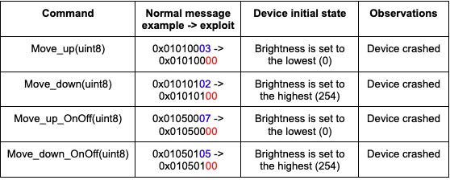

# Sengled Smart Bulb Vulnearability Report

## CVE-ID
CVE-2022-47100

## Vulnearability Description
The Sengled Zigbee Smart Bulb devices contain a denial-of-service vulnerability, which allows a remote attacker to send malicious Zigbee messages to a vulnerable device and cause crashes. 

## Affected product information 
|Name | Model | Firmware version| Notes|
|--|--|--|--|
| Sengled Zigbee Smart Light Bulbs| E21-N1EAW | 0x00000024| [Amazon Link](https://www.amazon.com/dp/B0899LJHVV?ref=nb_sb_ss_w_as-reorder-t1_ypp_rep_k0_1_19&amp=&crid=X42G8BLQW9II&sprefix=sengled%2Bsmart%2Bbulb%2B&th=1) |

## Vulnerability type
Denial of Service

## Triggering vulnerabilities
The vulnerabilities are related to four commands, as shown below, which increase or decrease the brightness of the device at a certain *rate*. The rate field is of the uint8 type and is highlighted with color in the messages below. 

To reproduce the crash, the device should be first at the “Device initial state”; after the exploit message is sent, the device crashes. For example, regarding the command  Move_up(unit_8), the payload of a normal message example is 0x01010003, where the last byte 0x03 indicates the rate value. If the device brightness is currently the lowest, after the exploit message (whose rate value is 0x00) is sent, the device crashes. 

In another word, the Sengled Zigbee Smart Bulb cannot process the rate value 0x00 properly when the device is at certain states.

## Attack Vectors
By crafting a valid Zigbee frame and sending it to the device.

